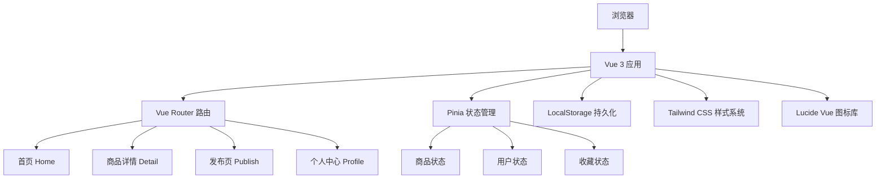
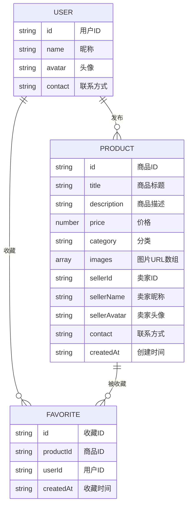

## 1. 架构设计

本项目为纯前端应用，使用 Vue 3 + TypeScript + Vite 构建，数据存储在 localStorage 中模拟后端。



## 2. 技术描述

- **前端框架**：Vue 3.4 + Composition API + `<script setup>` 语法
- **开发语言**：TypeScript 5.x
- **构建工具**：Vite 5.x
- **路由**：Vue Router 4.x
- **状态管理**：Pinia 2.x
- **样式方案**：Tailwind CSS 3.x
- **图标库**：Lucide Vue Next
- **数据存储**：浏览器 LocalStorage（模拟后端）
- **包管理器**：npm
- **项目模板**：vue-ts（Vite 官方 Vue + TypeScript 模板）

## 3. 目录结构

```
src/
├── components/          # 通用组件
│   ├── ProductCard.vue     # 商品卡片组件
│   ├── ImageUpload.vue     # 图片上传组件
│   ├── ImageCarousel.vue   # 图片轮播组件
│   ├── CategoryTabs.vue    # 分类标签组件
│   ├── SearchBar.vue       # 搜索栏组件
│   ├── BottomNav.vue       # 底部导航组件
│   ├── EmptyState.vue      # 空状态组件
│   └── SellerCard.vue      # 卖家信息卡片
├── composables/         # 组合式函数
│   ├── useProducts.ts      # 商品相关逻辑
│   ├── useUser.ts          # 用户相关逻辑
│   └── useFavorites.ts     # 收藏相关逻辑
├── pages/               # 页面组件
│   ├── Home.vue            # 首页
│   ├── Detail.vue          # 商品详情页
│   ├── Publish.vue         # 发布页
│   └── Profile.vue         # 个人中心
├── router/              # 路由配置
│   └── index.ts
├── stores/              # Pinia 状态
│   ├── product.ts          # 商品状态
│   ├── user.ts             # 用户状态
│   └── favorite.ts         # 收藏状态
├── types/               # TypeScript 类型定义
│   └── index.ts
├── mock/                # Mock 数据
│   └── products.ts
├── utils/               # 工具函数
│   ├── storage.ts          # 本地存储工具
│   └── format.ts           # 格式化工具
├── App.vue
├── main.ts
└── style.css            # 全局样式
```

## 4. 路由定义

| 路由路径 | 页面名称 | 功能说明 |
|----------|----------|----------|
| `/` | 首页 | 商品列表、搜索、分类筛选 |
| `/detail/:id` | 商品详情页 | 商品详情、图片轮播、卖家信息 |
| `/publish` | 发布页 | 发布商品表单、图片上传 |
| `/profile` | 个人中心 | 我的发布、我的收藏 |

## 5. 数据模型

### 5.1 实体关系图



### 5.2 TypeScript 类型定义

```typescript
// 商品分类
type ProductCategory = '全部' | '数码电子' | '图书教材' | '生活用品' | '服饰鞋包' | '美妆护肤' | '运动户外' | '其他';

// 商品信息
interface Product {
  id: string;
  title: string;
  description: string;
  price: number;
  category: ProductCategory;
  images: string[];
  sellerId: string;
  sellerName: string;
  sellerAvatar: string;
  contact: string;
  createdAt: string;
}

// 用户信息
interface User {
  id: string;
  name: string;
  avatar: string;
  contact: string;
}

// 收藏信息
interface Favorite {
  id: string;
  productId: string;
  userId: string;
  createdAt: string;
}
```

### 5.3 Mock 初始数据

```typescript
// 预置 12 条商品数据，覆盖各个分类
const mockProducts: Product[] = [
  {
    id: '1',
    title: 'iPad Pro 2022 11寸 256G',
    description: '自用 iPad Pro，95 新，带 Apple Pencil 二代，无磕碰无维修，学生自用，毕业出。',
    price: 4500,
    category: '数码电子',
    images: [...],
    sellerId: 'u1',
    sellerName: '小明同学',
    sellerAvatar: 'https://api.dicebear.com/7.x/avataaars/svg?seed=1',
    contact: '13800138001',
    createdAt: '2026-06-20T10:00:00Z'
  },
  // ... 更多 mock 数据
];
```

## 6. 核心功能实现要点

### 6.1 商品搜索与筛选

- 使用计算属性对商品列表进行过滤
- 搜索支持标题和描述的模糊匹配（`includes`）
- 分类筛选使用精确匹配
- 搜索和筛选可叠加使用

### 6.2 图片轮播

- 使用 CSS `transform: translateX()` 实现平滑切换
- 支持触摸滑动（`touchstart` / `touchend` 事件）
- 支持点击指示器切换
- 自动播放（可选项）

### 6.3 图片上传

- 使用 `<input type="file" accept="image/*" multiple>`
- `FileReader` 读取文件为 base64 预览
- 限制最大上传数量（如 9 张）
- 支持删除已上传图片

### 6.4 状态持久化

- Pinia store 变更时自动同步到 localStorage
- 应用初始化时从 localStorage 恢复数据
- 使用 `watch` 监听 store 变化实现自动保存

### 6.5 响应式布局

- 使用 Tailwind 的响应式前缀：`sm:` / `md:` / `lg:`
- 商品网格：`grid-cols-2 md:grid-cols-3 lg:grid-cols-4`
- 容器最大宽度：`max-w-6xl mx-auto`
- 底部导航仅移动端显示（`md:hidden`）

## 7. 性能优化

- 图片懒加载：``
- 列表虚拟化（商品较多时）
- 组件拆分，避免不必要的重渲染
- 使用 `v-memo` 优化列表渲染
- 路由懒加载
- 合理使用 `computed` 缓存计算结果

## 8. 开发规范

- 组件文件使用 PascalCase 命名
- 组合式函数使用 `use` 前缀命名
- TypeScript 严格模式开启
- 禁止使用 `any` 类型
- 使用 `<script setup lang="ts">` 语法
- 组件内逻辑按功能分块组织
