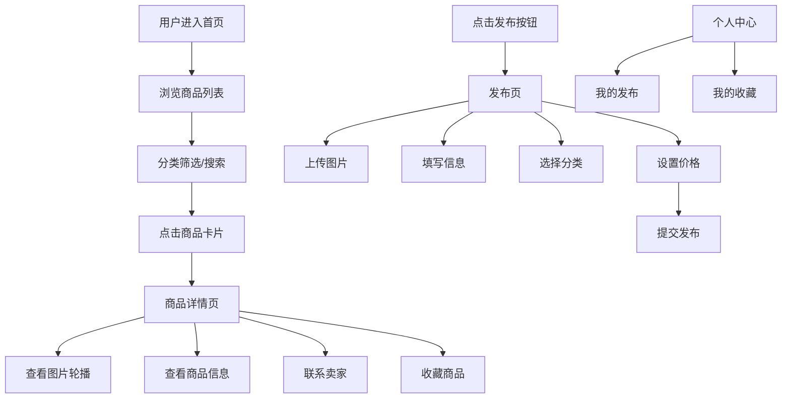

## 1. 产品概述

校园二手交易小站，专为在校学生打造的闲置物品交易平台。解决学生群体闲置物品流转困难、信息不对称的问题，让二手物品在校园内高效流通。

- 核心目标：提供简洁、安全、便捷的校园二手交易体验
- 目标用户：在校大学生、研究生
- 核心价值：低成本、高效率的闲置物品交易，绿色环保，资源共享

## 2. 核心功能

### 2.1 用户角色

| 角色 | 注册方式 | 核心权限 |
|------|----------|----------|
| 普通用户 | 模拟登录（游客模式） | 浏览商品、搜索筛选、查看详情、发布商品、收藏商品、管理个人中心 |

### 2.2 功能模块

1. **首页**：顶部搜索栏、分类筛选标签、商品列表卡片、底部导航
2. **商品详情页**：图片轮播、商品信息、价格展示、卖家信息卡片、联系方式按钮、收藏按钮
3. **发布页**：商品信息表单、多图上传、分类选择、价格设置、发布提交
4. **个人中心**：用户信息展示、Tab 切换（我的发布 / 我的收藏）、商品管理

### 2.3 页面详情

| 页面名称 | 模块名称 | 功能描述 |
|----------|----------|----------|
| 首页 | 搜索栏 | 关键词搜索商品，支持模糊匹配 |
| 首页 | 分类筛选 | 横向滚动分类标签，点击筛选对应分类商品 |
| 首页 | 商品列表 | 瀑布流/网格卡片布局，展示商品图片、标题、价格、发布时间 |
| 商品详情页 | 图片轮播 | 支持左右滑动/点击切换商品图片，带指示器 |
| 商品详情页 | 商品信息 | 展示标题、价格、分类、描述、发布时间 |
| 商品详情页 | 卖家信息 | 卖家头像、昵称、联系电话/微信按钮 |
| 发布页 | 图片上传 | 支持多图选择上传，预览和删除 |
| 发布页 | 表单填写 | 商品标题、描述、分类选择、价格输入 |
| 个人中心 | 我的发布 | 展示用户发布的所有商品，支持删除 |
| 个人中心 | 我的收藏 | 展示用户收藏的商品，支持取消收藏 |

## 3. 核心流程

### 浏览商品流程
用户进入首页 → 浏览商品列表 → 可选择分类筛选或搜索 → 点击商品卡片 → 进入商品详情页 → 查看详情/联系卖家/收藏

### 发布商品流程
用户点击底部发布按钮 → 进入发布页 → 上传商品图片 → 填写商品信息 → 选择分类 → 设置价格 → 提交发布 → 成功后跳转至我的发布

### 收藏与管理流程
用户浏览商品 → 点击收藏按钮 → 商品加入我的收藏 → 进入个人中心 → 切换 Tab 查看我的发布/我的收藏 → 可删除或取消收藏

## 4. 用户界面设计

### 4.1 设计风格

- **主色调**：暖橙色 `#FF7A45`，传递活力、温暖、年轻的氛围
- **背景色**：纯白色 `#FFFFFF`，干净整洁
- **辅助色**：浅橙色 `#FFF1EB`（用于标签背景、按钮悬浮态）
- **文字色**：主文本 `#333333`，次要文本 `#999999`
- **按钮风格**：圆角按钮，主按钮填充橙色，白色文字；次按钮边框橙色，橙色文字
- **字体**：系统无衬线字体，标题加粗，正文常规
- **布局风格**：卡片式布局，圆角 12px，阴影柔和，间距统一（8px 基数）
- **图标风格**：简洁线性图标，使用 Lucide Icons

### 4.2 页面设计概述

| 页面名称 | 模块名称 | UI 元素 |
|----------|----------|----------|
| 首页 | 搜索栏 | 橙色搜索图标，圆角输入框，占位文字"搜索心仪好物" |
| 首页 | 分类标签 | 横向滚动，未选中白底橙字，选中橙底白字，圆角 20px |
| 首页 | 商品卡片 | 两列网格，图片占满卡片顶部，下方展示标题、价格、发布时间，卡片间距 12px，整体 padding 12px |
| 商品详情页 | 图片轮播 | 全屏宽度，固定高度，底部指示器，切换动画 0.3s 平滑过渡 |
| 商品详情页 | 价格标签 | 大号橙色加粗字体，¥ 符号 |
| 商品详情页 | 卖家卡片 | 左侧头像圆形，中间昵称和发布时间，右侧联系按钮 |
| 发布页 | 上传区域 | 九宫格布局，加号按钮，已上传图片可删除 |
| 发布页 | 表单 | 分组卡片，输入框下划线样式，分类选择下拉/弹层 |
| 个人中心 | Tab 切换 | 顶部 Tab，选中下划线橙色，文字加粗 |
| 个人中心 | 用户信息 | 顶部头像、昵称、发布数/收藏数统计 |
| 全局 | 底部导航 | 固定底部，4 个 Tab：首页、分类、发布、我的，选中项橙色高亮 |

### 4.3 响应式设计

- **移动端优先**：以 375px 宽度为基准设计，使用 rem/vw 响应式单位
- **断点适配**：
  - < 640px：单列/两列布局，底部导航
  - 640px - 1024px：两列/三列布局
  - \> 1024px：三列/四列布局，最大宽度限制 1200px 居中
- **触摸优化**：按钮最小点击区域 44x44px，列表项点击反馈（背景色变化）
- **滚动优化**：长列表使用虚拟滚动或分页加载，图片懒加载

### 4.4 动画与交互

- 页面切换：左滑/右滑过渡动画 0.3s
- 卡片悬浮：桌面端 hover 时轻微上浮 + 阴影加深
- 图片加载：骨架屏占位，淡入加载
- 按钮点击：缩放效果 0.95 → 1，0.15s 过渡
- Tab 切换：下划线滑动动画
- 收藏按钮：心形图标填充动画
