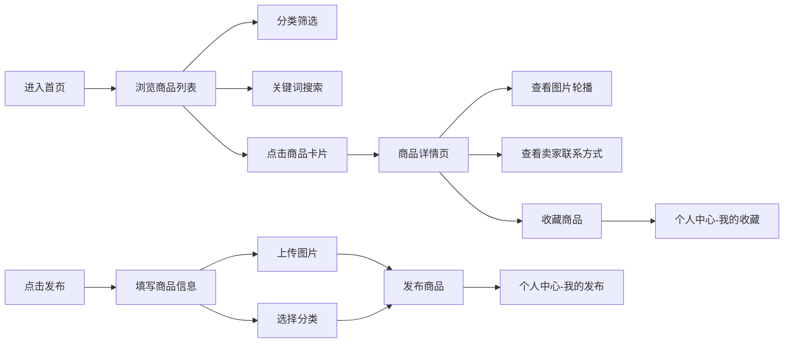

## 1. 产品概述

校园二手交易平台是一个面向在校大学生的闲置物品交易网站，帮助学生快速发布、浏览和交易二手商品，解决校园内闲置物品流转效率低的问题。

- 主要目的：为校园师生提供便捷、安全的二手商品交易渠道
- 目标用户：在校大学生、教职工
- 核心价值：降低交易成本，促进资源循环利用

## 2. 核心功能

### 2.1 用户角色
| 角色 | 注册方式 | 核心权限 |
|------|----------|----------|
| 普通用户 | 模拟登录（演示用） | 浏览商品、发布商品、收藏商品、查看个人中心 |

### 2.2 功能模块
1. **首页**：商品列表展示、分类筛选、关键词搜索
2. **商品详情页**：图片轮播、商品信息、卖家联系方式
3. **发布页**：商品信息填写、图片上传、分类选择、价格设定
4. **个人中心**：我的发布、我的收藏

### 2.3 页面详情
| 页面名称 | 模块名称 | 功能描述 |
|----------|----------|----------|
| 首页 | 搜索栏 | 支持关键词搜索商品 |
| 首页 | 分类导航 | 按商品分类筛选（数码、书籍、服饰、生活、运动等） |
| 首页 | 商品列表 | 卡片式布局展示商品，支持无限滚动/分页 |
| 商品详情页 | 图片轮播 | 多图轮播展示商品 |
| 商品详情页 | 商品信息 | 标题、价格、描述、发布时间、浏览量 |
| 商品详情页 | 卖家信息 | 卖家昵称、联系方式、联系按钮 |
| 发布页 | 表单填写 | 商品标题、描述、价格、分类选择 |
| 发布页 | 图片上传 | 多图上传预览 |
| 个人中心 | 我的发布 | 查看/删除自己发布的商品 |
| 个人中心 | 我的收藏 | 查看/取消收藏的商品 |

## 3. 核心流程

### 主要用户流程
用户进入首页 → 浏览/搜索/筛选商品 → 点击商品查看详情 → 联系卖家/收藏商品
用户点击发布 → 填写商品信息 → 上传图片 → 选择分类 → 发布成功 → 可在个人中心查看

## 4. 用户界面设计

### 4.1 设计风格
- **主色调**：暖橙色 (#FF8C42) - 温暖、活力，契合校园氛围
- **辅助色**：浅橙色 (#FFD4B8)、深橙色 (#E6732A)
- **背景色**：白色 (#FFFFFF)、浅灰 (#F8F8F8)
- **文字色**：深灰 (#333333)、中灰 (#666666)、浅灰 (#999999)
- **按钮风格**：圆角矩形，橙色填充，悬停加深
- **卡片风格**：白色背景、圆角、轻微阴影，悬停上浮效果
- **字体**：系统无衬线字体，标题加粗
- **布局**：卡片式网格布局，移动端单列

### 4.2 页面设计概览
| 页面名称 | 模块名称 | UI元素 |
|----------|----------|--------|
| 首页 | 顶部导航 | Logo、搜索框、发布按钮、个人中心入口 |
| 首页 | 分类标签 | 横向滚动分类标签，选中态橙色高亮 |
| 首页 | 商品网格 | 响应式卡片网格，展示图片、标题、价格、卖家 |
| 商品详情页 | 轮播图 | 全屏宽度轮播，指示点、切换按钮 |
| 商品详情页 | 信息区 | 价格（橙色大号字体）、标题、描述、发布时间 |
| 商品详情页 | 底部操作栏 | 收藏按钮、联系卖家按钮 |
| 发布页 | 表单 | 分组表单，输入框带标签，必填标记 |
| 发布页 | 图片上传区 | 拖拽/点击上传，预览网格，删除按钮 |
| 个人中心 | Tab切换 | 我的发布 / 我的收藏 切换 |
| 个人中心 | 列表 | 卡片列表，带删除/取消收藏操作 |

### 4.3 响应式设计
- **桌面端**：顶部导航固定，商品网格 4 列
- **平板端**：商品网格 3 列
- **移动端**：底部导航栏，商品网格单列，触控友好
- 采用移动端优先的响应式策略
- 触摸目标尺寸不小于 44px

### 4.4 动效与交互
- 卡片悬停：轻微上浮 + 阴影加深
- 图片加载：淡入效果
- 页面切换：平滑过渡
- 收藏按钮：心形图标填充动画
- 轮播图：平滑滑动切换
