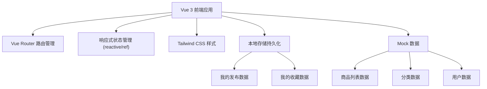

## 1. 架构设计

本项目为纯前端 Vue 应用，使用 mock 数据模拟后端接口，本地存储（localStorage）持久化用户发布和收藏数据。



## 2. 技术选型

- **前端框架**：Vue 3 + TypeScript
- **构建工具**：Vite 5
- **路由管理**：Vue Router 4
- **样式方案**：Tailwind CSS 3
- **状态管理**：Vue 3 Composition API (reactive/ref)
- **数据持久化**：localStorage
- **图标**：Lucide Vue

## 3. 目录结构

```
src/
├── components/          # 公共组件
│   ├── Header.vue       # 顶部导航
│   ├── BottomNav.vue    # 底部导航（移动端）
│   ├── ProductCard.vue  # 商品卡片
│   ├── ImageUpload.vue  # 图片上传组件
│   └── CategoryTabs.vue # 分类标签
├── pages/               # 页面组件
│   ├── Home.vue         # 首页
│   ├── ProductDetail.vue # 商品详情页
│   ├── Publish.vue      # 发布页
│   └── Profile.vue      # 个人中心
├── router/              # 路由配置
│   └── index.ts
├── data/                # Mock 数据
│   └── mock.ts
├── types/               # TypeScript 类型定义
│   └── index.ts
├── utils/               # 工具函数
│   └── storage.ts
├── App.vue
├── main.ts
└── style.css
```

## 4. 路由定义

| 路由 | 页面 | 说明 |
|------|------|------|
| / | 首页 | 商品列表、分类筛选、搜索 |
| /product/:id | 商品详情页 | 图片轮播、商品信息、卖家信息 |
| /publish | 发布页 | 发布商品表单 |
| /profile | 个人中心 | 我的发布、我的收藏 |

## 5. 数据模型

### 5.1 商品 (Product)
```typescript
interface Product {
  id: string;
  title: string;
  description: string;
  price: number;
  category: string;
  images: string[];
  seller: {
    id: string;
    name: string;
    avatar: string;
    phone: string;
    wechat: string;
  };
  createdAt: string;
  views: number;
  isMyPublish?: boolean;
}
```

### 5.2 分类 (Category)
```typescript
interface Category {
  id: string;
  name: string;
  icon: string;
}
```

### 5.3 用户 (User)
```typescript
interface User {
  id: string;
  name: string;
  avatar: string;
  phone: string;
  wechat: string;
}
```

### 5.4 本地存储
- `my_products`: 我发布的商品列表
- `my_favorites`: 我收藏的商品ID列表

## 6. 核心功能实现思路

### 6.1 商品列表与筛选
- 使用 computed 属性根据分类和搜索关键词过滤商品
- 支持关键词模糊匹配标题和描述

### 6.2 图片轮播
- 使用原生 CSS + Vue 响应式实现
- 支持左右切换和指示点点击
- 自动轮播 + 手动控制

### 6.3 图片上传
- 使用 `<input type="file">` 实现
- FileReader 读取本地图片预览
- 支持多图上传和删除

### 6.4 数据持久化
- 使用 localStorage 存储用户发布和收藏数据
- 页面加载时从 localStorage 读取数据
- 数据变化时自动保存

### 6.5 响应式布局
- 使用 Tailwind CSS 响应式类
- 移动端单列、平板 2-3 列、桌面 4 列
- 底部导航仅在移动端显示
