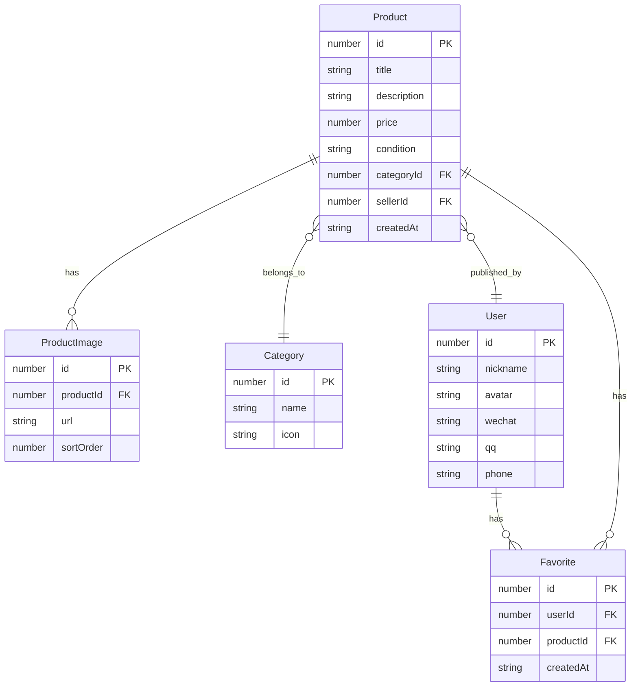

## 1. 架构设计

```mermaid
graph TB
    "前端 Vue3 + TS + Tailwind" --> "Vue Router"
    "Vue Router" --> "首页"
    "Vue Router" --> "商品详情页"
    "Vue Router" --> "发布页"
    "Vue Router" --> "个人中心"
    "前端 Vue3 + TS + Tailwind" --> "Mock 数据层"
    "前端 Vue3 + TS + Tailwind" --> "Composables"
```

纯前端项目，无后端服务，使用 Mock 数据模拟业务逻辑。

## 2. 技术说明

- 前端：Vue 3 + TypeScript + Tailwind CSS + Vite
- 初始化工具：vite-init (vue-ts 模板)
- 路由：Vue Router 4
- 后端：无（纯前端，Mock 数据）
- 数据库：无（内存状态管理）

## 3. 路由定义

| 路由 | 用途 |
|------|------|
| `/` | 首页，商品列表与分类筛选 |
| `/product/:id` | 商品详情页 |
| `/publish` | 发布商品页 |
| `/profile` | 个人中心页 |

## 4. API 定义

无后端 API，使用 Mock 数据直接在前端管理。

## 5. 数据模型

### 5.1 数据模型定义


